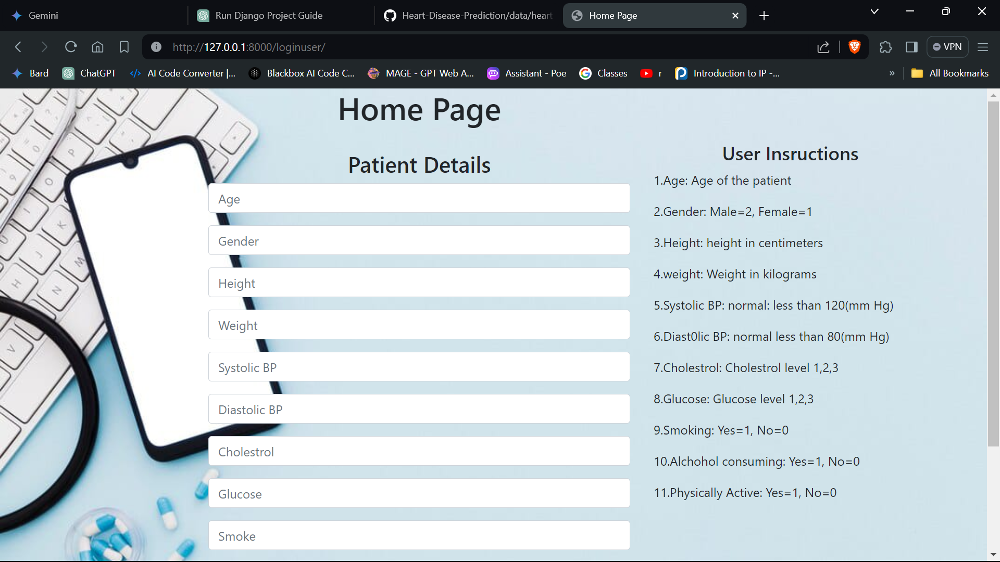
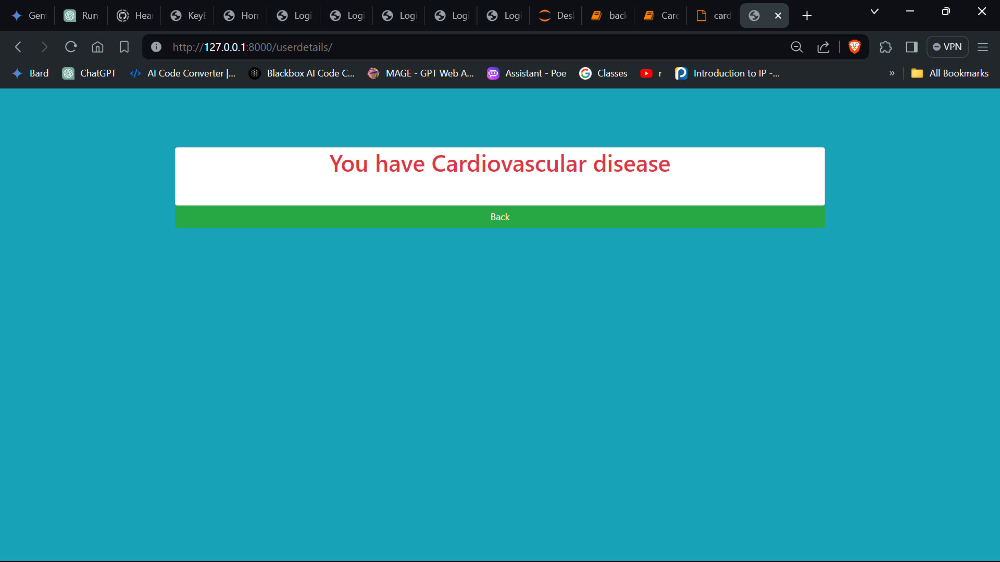
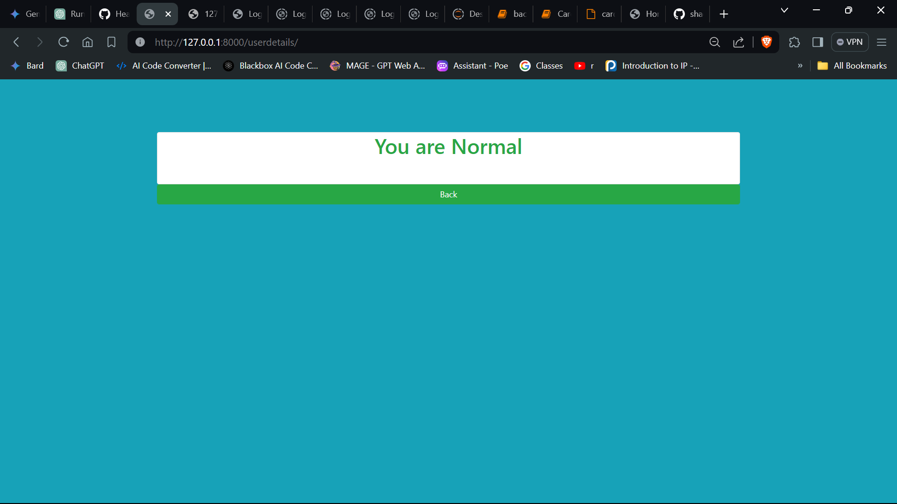

# Cardiovascular Disease Prediction System

This is a Django-based web application for predicting cardiovascular disease risk based on user-entered data. The system provides a user-friendly interface for signup, login, data entry, and viewing results.

## Features

- **Signup Page**: Users can create an account by providing basic information.
- **Login Page**: Registered users can log in securely to access the system.
- **Data Entry Page**: Users can enter their personal health data, including age, gender, height, weight, blood pressure, cholesterol levels, and lifestyle factors.
- **Result Page (Positive)**: Displays a positive result indicating the presence of cardiovascular disease based on the entered data.
- **Result Page (Negative)**: Displays a negative result indicating the absence of cardiovascular disease based on the entered data.

## Screenshots

### Signup Page


### Login Page


### Data Entry Page


### Positive Result Page


### Negative Result Page


## Backend Implementation

The backend of the Cardiovascular Disease Prediction System is implemented using Python and the Django web framework. Here's how the system works:

1. **Data Preprocessing**: The system starts by preprocessing the input data. It reads a dataset (`cardio_train.csv`) containing information about patients, including their age, gender, height, weight, blood pressure, cholesterol levels, and other health indicators.

2. **Feature Selection**: The system selects relevant features from the dataset to use for prediction. In the `userdetailsview` function of the `views.py` file, features such as age, gender, height, weight, blood pressure, cholesterol levels, smoking status, alcohol consumption, and physical activity are extracted from the user input.

3. **Model Training**: After feature selection, the system splits the dataset into training and testing sets using the `train_test_split` function from the `sklearn.model_selection` module. It then trains a machine learning model using the `Random Forest Classifier algorithm` from the `sklearn.ensemble` module. The model is trained on the training data to predict the presence or absence of cardiovascular disease based on the selected features.

4. **Prediction**: Once the model is trained, the system uses the input provided by the user to make a prediction. The user-entered data is converted into a numpy array and passed to the trained model's `predict` function. The model predicts whether the user has cardiovascular disease or not based on the input features.

5. **Result Rendering**: Finally, the system renders a result page (`result.html`) to display the prediction outcome to the user. If the model predicts that the user has cardiovascular disease, the result page displays a message indicating the presence of the disease. Otherwise, it displays a message indicating that the user is normal.

By leveraging machine learning algorithms and Django's powerful web development capabilities, the Cardiovascular Disease Prediction System provides users with valuable insights into their health status and helps them make informed decisions about their well-being.

## Getting Started

1. Clone the repository:

   ```bash
   git clone https://github.com/yourusername/cardiovascular-disease-prediction.git
   ```

2. Install dependencies:

   ```bash
   pip install -r requirements.txt
   ```

3. Run the Django server:

   ```bash
   python manage.py runserver
   ```

4. Open your web browser and navigate to [http://localhost:8000](http://localhost:8000) to access the application.
